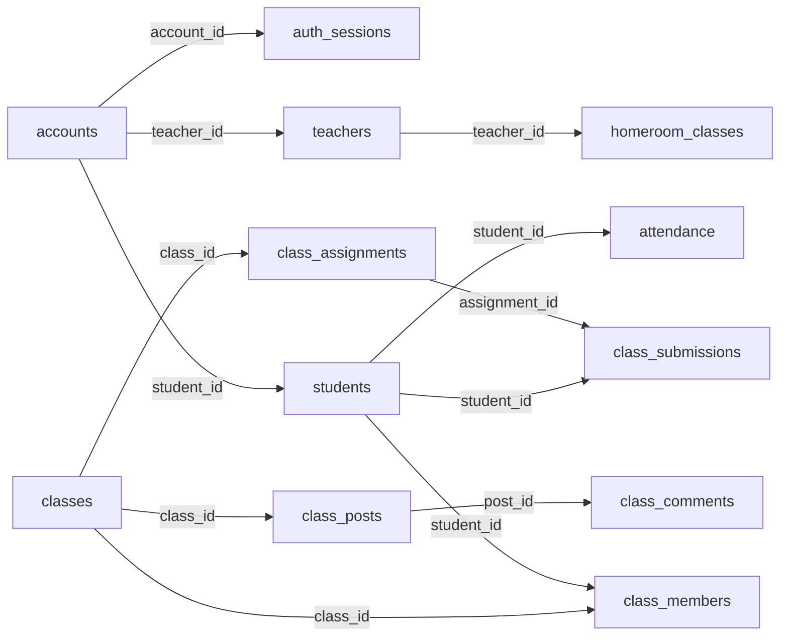

# Arsitektur Data & Peta Basis Data

Dokumen ini menjelaskan peta basis data PostgreSQL (**Neon** di produksi atau PostgreSQL lokal saat pengembangan) yang didefinisikan di [`db/schema.sql`](../db/schema.sql). Seluruh skema terdiri dari **40+ tabel** yang mendukung halaman publik, ruang kelas digital, absensi, komunitas alumni, serta sistem autentikasi tiga peran (`student`, `teacher`, `admin`).

---

## Daftar Isi

- [1. Tiga Kelompok Tabel](#1-tiga-kelompok-tabel)
  - [A. Konten Publik](#a-konten-publik)
  - [B. Akademik (dan Komunitas Alumni)](#b-akademik-dan-komunitas-alumni)
  - [C. Platform (Autentikasi, Moderasi, & Statistik)](#c-platform-autentikasi-moderasi--statistik)
- [2. Diagram Relasi Utama](#2-diagram-relasi-utama)
- [3. Tabel yang Paling Sering Ditanya](#3-tabel-yang-paling-sering-ditanya)
  - [`accounts`](#accounts)
  - [`auth_sessions`](#auth_sessions)
  - [`attendance`](#attendance)
  - [`class_members` vs `homeroom_classes`](#class_members-vs-homeroom_classes)
- [4. Cara Menjalankan Perubahan Skema](#4-cara-menjalankan-perubahan-skema)
- [5. Aturan Data & Privasi](#5-aturan-data--privasi)

---

## 1. Tiga Kelompok Tabel

Secara fungsional, seluruh tabel di `db/schema.sql` terbagi ke dalam tiga kelompok utama:

### A. Konten Publik

Kelompok ini menyimpan seluruh konten yang ditampilkan di halaman publik situs sekolah dan dikelola melalui CMS oleh peran `admin` (serta sebagian oleh `teacher`):

| Tabel | Kunci Utama (`PK`) | Fungsi & Kolom Penting |
|---|---|---|
| `school_profile` | `id` (`text`, default `'default'`) | Identitas utama sekolah (`nama`, `npsn`, `akreditasi`, `skor_akreditasi`, `tahun_berdiri`, `alamat`, `telepon`, `email`, `visi`, serta kolom `jsonb` seperti `misi`, `stats`, `socials`). |
| `accreditations` | `id` (`serial`) | Riwayat akreditasi sekolah per tahun (`tahun`, `peringkat`, `skor`, `keterangan`) dengan constraint `unique (tahun, peringkat)`. |
| `news` | `id` (`uuid`) | Artikel berita sekolah (`slug` unik, `title`, `excerpt`, `content`, `category`, `cover_key`, `views`, `status`, `published_at`). Dapat ditautkan ke ekskul (`ekskul_id`) atau prestasi (`achievement_id`). |
| `announcements` | `id` (`uuid`) | Pengumuman resmi (`title`, `body`, `audience`, `urgent`, `pinned`, `status`, `published_at`). |
| `achievements` | `id` (`text`) | Daftar prestasi siswa dan sekolah (`title`, `level`, `category`, `award_type`, `year`, `participants` bertipe `jsonb`, `student_name`, `ekskul_id`, `status`). |
| `extracurriculars` | `id` (`text`) | Direktori ekstrakurikuler (`name`, `category`, `logo_key`, `thumb_key`, `members`, `achievements`, `schedule`, `advisor`, `sort`). |
| `gallery_albums` | `id` (`text`) | Album dokumentasi foto kegiatan (`title`, `category`, `cover_key`, `taken_at`, `sort`). |
| `gallery_photos` | `id` (`uuid`) | Butir foto di dalam album (`album_id` merujuk ke `gallery_albums.id` dengan `on delete cascade`, `image_key`, `caption`, `sort`). Dijaga dari duplikasi oleh `idx_gallery_photos_unique`. |
| `facilities` | `id` (`text`) | Daftar sarana dan prasarana sekolah (`name`, `category`, `floor`, `building`, `capacity`, `image_key`, serta galeri ruangan `images` bertipe `jsonb`). |
| `facility_highlights` | `id` (`text`) | Sorotan fasilitas utama yang tampil di halaman depan (`title`, `description`, `image_key`, `sort`). |
| `hero_slides` | `id` (`text`) | Gambar karusel utama di beranda (`image_key`, `alt`, `caption`, `sort`). |
| `people_photos` | `id` (`text`) | Koleksi foto warga sekolah untuk tampilan visual halaman publik (`image_key`, `alt`, `sort`). |
| `testimonials` | `id` (`text`) | Kutipan testimoni siswa, guru, atau alumni (`name`, `role`, `quote`, `photo_key`, `sort`). |
| `events` | `id` (`text`) | Agenda dan kalender kegiatan sekolah (`title`, `category`, `start_at`, `end_at`, `location`, `all_day`, `audience`), diindeks dengan `idx_events_start`. |
| `faqs` | `id` (`text`) | Tanya-jawab umum dan seputar PPDB (`question`, `answer`, `category`, `sort`). |
| `ppdb_config` | `id` (`text`, default `'default'`) | Konfigurasi Penerimaan Peserta Didik Baru (`registration_open_at`, serta kolom `jsonb`: `steps`, `schedule`, `fees`, `scholarships`). |

---

### B. Akademik (dan Komunitas Alumni)

Kelompok ini menangani operasional belajar-mengajar di dashboard siswa dan guru, mulai dari data induk sivitas akademika, ruang kelas digital, tugas, hingga presensi harian:

| Tabel | Kunci Utama (`PK`) | Fungsi & Kolom Penting |
|---|---|---|
| `teachers` | `id` (`text`) | Data guru dan staf pengajar (`name`, `subject`, `position`, `photo_key`, `email`, `nig`, `sort`), diindeks pada `idx_teachers_nig`. |
| `students` | `id` (`text`) | Data siswa (`name`, `class_name`, `nisn`, `photo_key`, `user_id`), diindeks pada `idx_students_nisn` dan `idx_students_class_name`. |
| `homeroom_classes` | `id` (`text`) | Daftar rombongan belajar (rombel) dan wali kelasnya (`grade`, `name`, `teacher_id` merujuk ke `teachers.id`, `teacher_name`, `room`, `sort`). |
| `classes` | `id` (`text`) | Ruang kelas mata pelajaran digital bergaya Google Classroom (`name`, `subject`, `section`, `room`, `code` unik untuk bergabung, `teacher_name`, `color`). |
| `class_members` | `(class_id, student_id)` | Keanggotaan siswa di dalam `classes` (`class_id`, `student_id`, `enrolled`, `requested_at`). |
| `class_posts` | `id` (`text`) | Kiriman pengumuman atau materi (`kind` bernilai `'announcement'` atau `'material'`) di lini masa kelas (`class_id`, `author_name`, `content`, `attachment_key`). |
| `class_comments` | `id` (`text`) | Komentar diskusi pada kiriman kelas (`post_id` merujuk ke `class_posts.id` dengan `on delete cascade`, `author_name`, `content`). |
| `class_assignments` | `id` (`text`) | Tugas kelas (`class_id`, `title`, `instructions`, `topic`, `due_at`, `points`, `attachment_key`), diindeks dengan `idx_class_assignments_class`. |
| `class_submissions` | `id` (`text`) | Pengumpulan tugas oleh siswa (`assignment_id`, `student_id`, `status` bernilai `'assigned'`, `'turned_in'`, atau `'graded'`, `drive_url`, `object_key`, `grade`, `feedback`) dengan constraint `unique (assignment_id, student_id)`. |
| `class_schedules` | `id` (`text`) | Jadwal pelajaran mingguan (`day`, `start_time`, `end_time`, `subject`, `class_name`, `room`, `teacher`, `audience`, `sort`). |
| `attendance` | `id` (`uuid`) | Presensi harian siswa (`student_id`, `date`, `status` bernilai `'Masuk'`, `'Izin'`, `'Sakit'`, atau `'Alpa'`, `selfie_key`, `check_in_time`, `recorded_by`). |

Selain tabel akademik aktif, terdapat sub-kelompok **Komunitas Alumni** untuk halaman `/komunitas/alumni`:
- `alumni` (`id`, `name`, `graduation_year`, `job_title`, `company`, `city`, `field`, `university`, `linkedin_url`, `story`)
- `alumni_paths` (`id`, `alumni_id` merujuk ke `alumni.id`, `year`, `title`, `place`)
- `alumni_educations` (`id`, `alumni_id` merujuk ke `alumni.id`, `university_id` merujuk ke `universities.id`, `major`, `year`)
- `cities` (`id`, `name`, `province`, `lat`, `lng`) dan `universities` (`id`, `name`, `city`, `logo_key`, `lat`, `lng`) untuk pemetaan sebaran alumni.

---

### C. Platform (Autentikasi, Moderasi, & Statistik)

Kelompok ini mengelola akun login, sesi aktif, perlindungan *brute-force*, antrean moderasi konten, preferensi pengguna, dan analitik kunjungan tanpa data pribadi:

| Tabel | Kunci Utama (`PK`) | Fungsi & Kolom Penting |
|---|---|---|
| `accounts` | `id` (`uuid`) | Akun kredensial login (`username` unik, `password_hash`, `role`, `name`, `status`, `student_id`, `teacher_id`). |
| `auth_sessions` | `token` (`text`) | Sesi login berbasis cookie `httpOnly` (`account_id` merujuk ke `accounts.id`, `created_at`, `expires_at`, `last_seen_at`). |
| `auth_login_attempts` | `username` (`text`) | Pencatat percobaan gagal login untuk pencegahan *brute-force* (`failed_count`, `first_failed_at`, `last_attempt_at`, `locked_until`). |
| `profiles` | `id` (`uuid`) | Profil pengguna platform (`email` unik, `full_name`, `role`, `avatar_key`, `detail`, `status`). |
| `moderation_queue` | `id` (`text`) | Antrean peninjauan konten sebelum terbit (`type`, `title`, `author`, `status` bernilai `'pending'`, `'approved'`, atau `'rejected'`). |
| `notifications` | `id` (`uuid`) | Notifikasi di dalam dashboard (`user_id` merujuk ke `profiles.id` dengan `on delete cascade`, `title`, `body`, `unread`, `created_at`). |
| `user_preferences` | `user_id` (`uuid`) | Penyimpanan pengaturan pengguna di sisi server (`user_id` merujuk ke `profiles.id`, `prefs` bertipe `jsonb`). |
| `page_views` | `(day, path)` | Agregat jumlah tampilan halaman harian (`day`, `path`, `views`, `updated_at`), diindeks dengan `idx_page_views_day`. |
| `site_visits` | `(day, visitor_id)` | Statistik pengunjung unik harian tanpa menyimpan data pribadi (`day`, `visitor_id`, `first_seen`), diindeks dengan `idx_site_visits_day`. |

---

## 2. Diagram Relasi Utama

Berikut adalah diagram relasi sederhana untuk tabel autentikasi, akademik, dan ruang kelas digital:



---

## 3. Tabel yang Paling Sering Ditanya

Bagian ini menjelaskan desain kolom kunci, relasi, dan indeks pada empat area yang paling sering disentuh saat mengembangkan fitur dashboard maupun autentikasi.

### `accounts`

Tabel `accounts` adalah pusat autentikasi satu pintu untuk ketiga peran (`role in ('student', 'teacher', 'admin')`):

- **Penautan peran ke entitas akademik (`student_id` dan `teacher_id`):**
  Satu baris di `accounts` memiliki kolom opsional `student_id` (`references students (id) on delete cascade`) dan `teacher_id` (`references teachers (id) on delete cascade`).
  - Jika `role = 'student'`, maka `student_id` berisi ID siswa terkait (dan `username` berisi NISN siswa), sedangkan `teacher_id` bernilai `null`.
  - Jika `role = 'teacher'`, maka `teacher_id` berisi ID guru terkait (dan `username` berisi NIP/NIG guru), sedangkan `student_id` bernilai `null`.
  - Jika `role = 'admin'`, baik `student_id` maupun `teacher_id` bernilai `null` (dan `username` dapat berupa NPSN atau identitas admin).
  Saat sesi dibaca di `src/lib/auth-server.ts` (`getSessionAccount`), aplikasi melakukan `left join students` pada `a.student_id` dan `left join homeroom_classes` pada `a.teacher_id` untuk langsung mendapatkan informasi kelas (`className`) dalam satu kueri.
- **Kenapa `idx_accounts_role` (serta `idx_accounts_student` dan `idx_accounts_teacher`) ada:**
  - `idx_accounts_role` (`on accounts (role)`) mempercepat filter daftar akun berdasarkan peran di panel manajemen pengguna admin serta penghitungan statistik akun per peran tanpa melakukan *sequential scan*.
  - `idx_accounts_student` (`on accounts (student_id)`) dan `idx_accounts_teacher` (`on accounts (teacher_id)`) mempercepat *join* balik dari tabel `students` atau `teachers` ke `accounts` serta mempercepat operasi `on delete cascade` ketika data induk siswa/guru dihapus.

### `auth_sessions`

Tabel `auth_sessions` menyimpan sesi login berbasis token acak (`token` sebagai `primary key`):

- **Kenapa ada tiga indeks di `auth_sessions`:**
  1. `idx_auth_sessions_account` (`on auth_sessions (account_id)`): Mempercepat pencarian seluruh sesi milik satu akun tertentu (misalnya saat mencabut semua sesi milik satu pengguna atau saat penghapusan akun memicu `on delete cascade`).
  2. `idx_auth_sessions_expires` (`on auth_sessions (expires_at)`): Mempercepat proses pembersihan (*purge*) sesi yang sudah kedaluwarsa (`where expires_at < now()`) serta validasi masa berlaku sesi.
  3. `idx_auth_sessions_last_seen` (`on auth_sessions (last_seen_at desc)`): Mempercepat pemantauan pengguna yang sedang aktif/online di dashboard admin yang mengurutkan aktivitas terbaru berdasarkan `last_seen_at` menurun. Untuk menjaga beban basis data tetap ringan, kolom `last_seen_at` hanya diperbarui maksimal satu kali setiap 2 menit (`last_seen_at < now() - interval '2 minutes'`).
- **Bagaimana sesi di-purge (dibersihkan):**
  Pembersihan sesi dilakukan secara otomatis tanpa memerlukan *cron job* eksternal:
  1. **Saat login baru (`createSession` di `src/lib/auth-server.ts`):** Menggunakan *Common Table Expression* (CTE) dalam satu *round-trip* SQL yang menghapus seluruh baris kedaluwarsa (`delete from auth_sessions where expires_at < now()`) sekaligus menyisipkan sesi baru.
  2. **Saat logout (`destroySession`):** Menghapus baris sesi secara langsung berdasarkan `token` (`delete from auth_sessions where token = $1`).
  3. **Saat akun dihapus:** Terhapus otomatis berkat klausa `references accounts (id) on delete cascade`.

### `attendance`

Tabel `attendance` menyimpan catatan kehadiran harian siswa (`Masuk`, `Izin`, `Sakit`, `Alpa`) beserta bukti swafoto (`selfie_key`):

- **Kenapa `idx_attendance_date` memakai `date desc`:**
  Di dashboard guru (wali kelas) maupun siswa, tampilan presensi hampir selalu memuat **hari ini atau rentang tanggal terbaru terlebih dahulu** (`order by date desc`). Indeks `idx_attendance_date` (`on attendance (date desc)`) memastikan pembacaan rekap harian terbaru dapat langsung diambil secara terurut dari *B-tree index* tanpa pengurutan ulang di memori.
- **Pencegahan duplikasi harian:**
  Selain indeks tanggal, tabel ini memiliki constraint `unique (student_id, date)` yang secara otomatis membuat indeks unik gabungan pada `(student_id, date)`. Hal ini menjamin satu siswa hanya memiliki tepat satu baris status kehadiran per tanggal kalender dan mendukung operasi *upsert* (`on conflict (student_id, date) do update`) saat wali kelas memperbarui status presensi.

### `class_members` vs `homeroom_classes`

Kedua tabel ini sama-sama berkaitan dengan "kelas", tetapi mewakili dua konsep yang berbeda di sekolah:

- **`homeroom_classes` (Rombongan Belajar / Kelas Wali Resmi):**
  Mewakili kelas administratif resmi sekolah tempat seorang siswa terdaftar (misalnya `grade = 11`, `name = 'XI IPA 3'`) yang dipimpin oleh satu wali kelas (`teacher_id` merujuk ke `teachers.id`). Hubungannya dengan siswa bersifat satu-ke-banyak melalui nama rombel pada `students.class_name` (diindeks oleh `idx_students_class_name`). Digunakan untuk rekap absensi harian dan rapor wali kelas.
- **`class_members` (Keanggotaan Ruang Kelas Mata Pelajaran Digital):**
  Menghubungkan `students` dengan `classes` (ruang kelas mata pelajaran digital seperti Matematika, Fisika, atau Bahasa Indonesia) dalam relasi **banyak-ke-banyak** (`primary key (class_id, student_id)`).
  - Satu siswa di `students` dapat bergabung ke banyak `classes` menggunakan kode kelas (`classes.code`).
  - Kolom `enrolled` (`boolean not null default true`) dan `requested_at` mengatur alur persetujuan guru: ketika siswa baru meminta bergabung ke sebuah kelas, baris dibuat dengan `enrolled = false` (menunggu persetujuan/ACC guru pengampu) sebelum berubah menjadi `enrolled = true`.
  - Diindeks tambahan dengan `idx_class_members_student` (`on class_members (student_id)`) agar daftar kelas yang diikuti seorang siswa dapat dimuat cepat di dashboard siswa.

---

## 4. Cara Menjalankan Perubahan Skema

Untuk membuat seluruh tabel dan indeks pada basis data lokal maupun Neon, jalankan perintah berikut:

```bash
node scripts/db-init.mjs
```

Atau bila ingin memuat variabel langsung dari `.env.local` tanpa alat tambahan:

```bash
node --env-file=.env.local scripts/db-init.mjs
```

### Sifat Idempotent & Sumber Kebenaran Skema

- **Idempotent dan aman dijalankan berulang kali:**
  Skrip `scripts/db-init.mjs` membaca seluruh isi [`db/schema.sql`](../db/schema.sql), memecahnya per pernyataan SQL, lalu mengeksekusinya secara berurutan (otomatis memilih driver `@neondatabase/serverless` untuk host `*.neon.tech` atau `pg` untuk PostgreSQL lokal). Karena seluruh definisi di `db/schema.sql` menggunakan klausa `create table if not exists`, `create index if not exists`, dan `alter table ... add column if not exists`, skrip ini **sepenuhnya idempotent** — aman dijalankan berkali-kali tanpa menghapus atau merusak data yang sudah ada.
- **`db/schema.sql` adalah sumber kebenaran (*single source of truth*):**
  `scripts/db-init.mjs` hanya bertugas mengeksekusi isi `db/schema.sql` dan tidak menyimpan logika migrasi terpisah. Jika Anda perlu menambahkan tabel baru, indeks baru, atau kolom baru pada tabel yang sudah ada:
  1. Tambahkan definisi tersebut langsung di `db/schema.sql` (untuk penambahan kolom pada tabel yang sudah ada di produksi, sertakan pernyataan `alter table <nama_tabel> add column if not exists <nama_kolom> <tipe_data>;` agar basis data yang sudah berjalan ikut terbarui).
  2. Jalankan kembali `node scripts/db-init.mjs` untuk menerapkan perubahan tersebut.

---

## 5. Aturan Data & Privasi

- **`db/schema.sql` hanya berisi struktur skema, bukan data siswa:**
  Berkas `db/schema.sql` hanya boleh memuat definisi struktur tabel, indeks, dan constraint.
- **Larangan keras menyertakan PII / data nyata:**
  **Jangan pernah** memasukkan Nomor Induk Siswa Nasional (`nisn`), NIP/NIG asli, alamat surel pribadi, nomor telepon pribadi, maupun data nyata siswa/guru ke dalam berkas *seed*, pengujian (`tests/`), dokumentasi, atau kode sumber (*source code*). Gunakan selalu data fiktif/sintetis untuk kebutuhan pengembangan dan pengujian.
